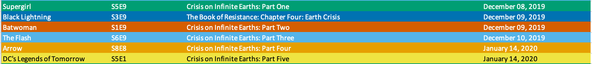

# TV Universe Watchlist Generator
This script allows users to search for multiple series and receive a color-coded watchlist sorted in order of episode airdate.

## Requirements
Python 3.7+

## Installation
Use the package manager [pip](https://pip.pypa.io/en/stable/) to install the required dependencies.

```bash
pip install -r requirements.txt
```

## API Key
If needed, a free API key can be obtained from omdbapi.com
Then, rename `config_example.py` to `config.py` and replace the placeholder with your API key.

## How to run code
```bash
python watchlist.py
```

## File Download
The generated watchlist file will save to the same folder as the watchlist.py script. Note that sorting is by airdate; specific airtimes are unavailable. Thus, any same-day back-to-back airings of two or more shows may appear out of order in the watchlist.

## File Example


## License

[MIT](https://choosealicense.com/licenses/mit/)

## Acknowledgement
[OMDb API](https://www.omdbapi.com/)